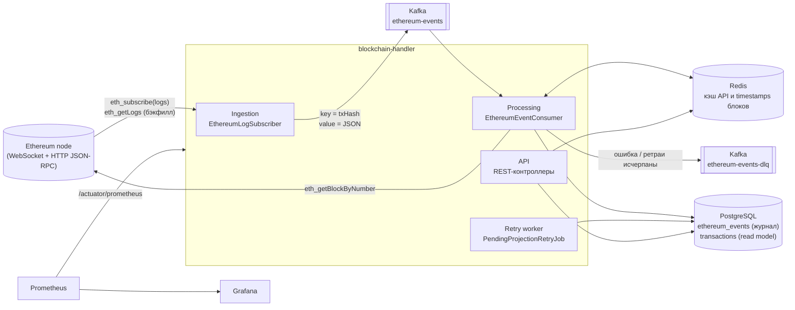

# Blockchain Handler — агрегатор событий Ethereum

Сервис на Java 21 / Spring Boot 3.5. Что он делает:
- слушает события `Transfer` контракта USDC (ERC-20) в Ethereum mainnet;
- прогоняет их через Kafka;
- обогащает временем блока, checksum-адресами и суммой в USDC;
- хранит в PostgreSQL;
- отдаёт через REST API с кэшем в Redis.

Метрики уходят в Prometheus/Grafana, логи — в JSON с `traceId` для каждого события.

Проект задуман как production-ready. Помимо «счастливого пути» в нём решены:
- переподключение к ноде без потери событий (бэкфилл пропусков);
- идемпотентная обработка при at-least-once доставке;
- DLQ с исходными байтами сообщения;
- компенсация реоргов цепочки;
- партиционирование журнала событий;
- race-free инвалидация кэша.

---

## Содержание

- [Архитектура](#архитектура)
- [Ключевые решения](#ключевые-решения)
- [Отступления от ТЗ](#отступления-от-тз)
- [Быстрый старт (Docker)](#быстрый-старт-docker)
- [Локальная разработка](#локальная-разработка)
- [Конфигурация](#конфигурация)
- [REST API](#rest-api)
- [Kafka-контракт и DLQ](#kafka-контракт-и-dlq)
- [Схема БД](#схема-бд)
- [Наблюдаемость](#наблюдаемость)
- [Тесты](#тесты)
- [Структура проекта](#структура-проекта)
- [Ограничения и что дальше](#ограничения-и-что-дальше)

---

## Архитектура



| Слой | Пакет | Что делает |
|---|---|---|
| Ingestion | `ingestion` | WebSocket-подписка `eth_subscribe("logs")` на USDC `Transfer`. Переподключение с экспоненциальной задержкой, бэкфилл пропусков через `eth_getLogs`, watchdog «зависшей» подписки. Публикует события в Kafka. |
| Processing | `processing` | Kafka-консьюмер: декодирует ABI, обогащает событие (timestamp блока из Redis/ноды, checksum-адреса, value → USDC), пишет в журнал `ethereum_events` и проецирует в `transactions`. Ретраи с экспоненциальной задержкой, DLQ. |
| Storage | `storage` | Сущности и Spring Data JPA-репозитории. Идемпотентные записи через нативные `INSERT … ON CONFLICT`. |
| API | `api` | REST-контроллеры, DTO (records), MapStruct, Jakarta Validation, `@RestControllerAdvice` с RFC 7807. |
| Cache | `cache` | Redis-кэш: TTL на каждый кэш, типизированные сериализаторы, инвалидация через «поколения» адресов. |
| Observability | `observability` | Метрики Micrometer, health-индикатор WebSocket-соединения. |

### Путь одного события

1. **Ingestion.** Нода пушит лог по WebSocket. `LogMessageMapper` переводит hex-поля в числа и определяет тип события по `topic0`. `EthereumEventPublisher` отправляет JSON в `ethereum-events` с ключом `txHash`. Каждое событие публикуется внутри отдельного Micrometer `Observation`, поэтому у него свой `traceId`, который уходит в заголовки Kafka.
2. **Приём.** `EthereumEventConsumer` получает `byte[]`. `ByteArrayJsonMessageConverter` конвертирует его в `EthereumEventMessage`, затем срабатывает `@Valid`. Трейс продолжается из заголовков: в MDC оказываются `traceId`, `txHash`, `blockNumber`, `logIndex`.
3. **Decode.** `TransferEventDecoder` (web3j ABI) достаёт `from`, `to`, `value` и проверяет число топиков: у ERC-721 та же сигнатура, но 4 топика.
4. **Enrich.** `EventEnrichmentService`:
   - `blockTimestamp` через `eth_getBlockByNumber`, результат кэшируется в Redis на 1 час. USDC даёт около 70 переводов на блок, так что вместо ~70 вызовов ноды получается один;
   - адреса в EIP-55;
   - `value / 10^6` точно, через `BigDecimal`.
5. **Journal** (TX1). Событие добавляется в партиционированный журнал `ethereum_events` с `processed=false`. Повторная доставка ничего не меняет: срабатывает `ON CONFLICT DO NOTHING`.
6. **Project** (TX2). Строка журнала блокируется через `FOR UPDATE SKIP LOCKED`, затем делается upsert в `transactions` (для реорга — delete) и выставляется `processed=true`. После коммита сбрасывается кэш API.

---

## Ключевые решения

### Надёжность ingestion
- **Переподключение с экспоненциальной задержкой и jitter.** Задержки растут как 1 с → 2 с → … → 60 с, ±20 % (`ReconnectBackoff`). У каждого подключения свой id, поэтому двойной сигнал (onError + onClose) даёт ровно одно переподключение.
- **Бэкфилл пропусков.** Пока подписки нет, события продолжают происходить. После каждой (пере)подписки сервис дочитывает пропущенное через `eth_getLogs` — чанками по 50 блоков, не более 1000 блоков. Начало пропуска вычисляет `PublishProgress`:
  - либо последний опубликованный блок;
  - либо самый ранний блок, который не удалось отправить в Kafka.

  Checkpoint сохраняется в Redis, поэтому после рестарта сервис тоже догоняет пропущенное. Дубли безопасны, потому что обработка идемпотентна.
- **Watchdog.** WebSocket может оставаться открытым, а нода при этом перестаёт присылать события. Если 2 минуты нет ни одного лога (для USDC это невозможно), подписка пересоздаётся. Мёртвый TCP ловит ping/pong (`heartbeat-interval`).
- **Kafka не блокирует WebSocket.** Логи переносятся с read-потока WebSocket на отдельный поток публикации (`observeOn`).

### Обработка: at-least-once и идемпотентность
- Kafka-продьюсер работает с `acks=all` и `enable.idempotence=true`; консьюмер — с ручными коммитами.
- Ключ записи — `txHash`. Все логи транзакции, включая их реорг-удаления, попадают в одну партицию и обрабатываются по порядку.
- Идентичность лога в сети — `(block_hash, log_index)`, а не `tx_hash`: в одной транзакции бывает несколько Transfer, а после реорга та же транзакция попадает в другой блок.

### Журнал + проекция (inbox)
`ethereum_events` — источник истины слоя обработки, `transactions` — read model для API.

Проекция идёт в отдельной транзакции. Если она упала (например, баг в проекции нового типа события), событие не теряется и не блокирует партицию Kafka: `retry_count` увеличивается, `last_attempt_at` обновляется. `PendingProjectionRetryJob` ретраит такие строки с экспоненциальной задержкой `30s·2^retry_count`, используя частичный индекс `(processed, retry_count) WHERE processed = false`. Благодаря `SKIP LOCKED` воркер безопасен и при нескольких инстансах.

### Ретраи и DLQ
| Ошибка | Поведение |
|---|---|
| Не JSON / неверные типы (`ConversionException`) | сразу в DLQ |
| Нарушение контракта (`@Valid`, `MethodArgumentNotValidException`) | сразу в DLQ |
| Не тот ABI / чужой контракт (`NonRetryableEventException`) | сразу в DLQ |
| Нода недоступна / блок ещё не виден (`BlockTimestampUnavailableException`), сбой БД | 5 ретраев с задержкой 1 с → 2 с → 4 с → 8 с → 16 с, затем DLQ |

На проводе значения передаются как `byte[]`, JSON собирается в listener-адаптере. Поэтому «ядовитое» сообщение не может застрять в десериализаторе, а в DLQ всегда лежат **исходные байты** с заголовками `kafka_dlt-*`: исключение, stacktrace, исходные топик, партиция и оффсет. DLQ-партиция совпадает с исходной.

### Реорганизации цепочки
web3j-класс `websocket.events.Log` теряет флаг `removed`, поэтому подписка десериализуется в собственный `RpcLogNotification`. Лог с `removed=true` проходит весь пайплайн:
- в журнале он хранится отдельной строкой (`removed` входит в уникальный ключ);
- проекция удаляет перевод по `(block_hash, log_index)`;
- вставка перевода проверяет, нет ли в журнале его удаления, поэтому поздний ретрай не «воскресит» осиротевший лог.

### Партиционирование
`ethereum_events` разбита по месяцам `block_timestamp` (`PARTITION BY RANGE`). Партиции создаёт SQL-функция `ensure_ethereum_events_partition`. Она идемпотентна, считает границы месяца строго в UTC и сериализуется через `pg_advisory_xact_lock`. Вызывают её:
- Liquibase при миграции: партиции от «−1 месяц» до «+3 месяца»;
- `PartitionMaintenanceJob` при старте и ежедневно;
- `PartitionManager` по требованию — для исторических событий.

Вместо identity-колонки используется sequence: identity на партиционированных таблицах появился только в PostgreSQL 17.

### Кэш
| Кэш | TTL | Инвалидация |
|---|---|---|
| `transfers-by-address` | 60 с | «поколения»: новый перевод меняет токен поколения у `from` и `to` |
| `transaction-details` | 60 с | точечный `evict(txHash)` |
| `daily-stats` | 60 с | только TTL: ключ текущего дня меняется ~6 раз/с, инвалидация обнулила бы hit-rate |
| `block-timestamps` | 1 ч | не нужна (блок неизменен) |

**Поколения.** Ключ страницы строится как `address|g<generation>|from|to|page|size`. Когда консьюмер **после коммита** проекции ставит новое случайное поколение адреса, все закэшированные страницы этого адреса становятся недостижимы. Это O(1): без `SCAN`/`KEYS` и без индексных множеств. Бонус — нет гонки: медленный запрос, прочитавший БД до коммита, положит результат под **старым** поколением, и его никто не прочитает.

Остальное:
- значения сериализуются типизированным Jackson-сериализатором на каждый кэш, без polymorphic typing;
- `CacheErrorHandler` превращает недоступность Redis в cache miss, и API продолжает работать из PostgreSQL;
- Lettuce timeout — 500 мс.

---

## Отступления от ТЗ

| ТЗ | Сделано | Почему |
|---|---|---|
| `pom.xml` (Maven) | Gradle Kotlin DSL | Решение владельца проекта. Wrapper — **Gradle 8.14.5**: Spring Boot 3.5 официально поддерживает Gradle 7.6.4+/8.x, но не 9.x. |
| ZooKeeper в docker-compose | Kafka **KRaft** (`apache/kafka:4.3.1`) | С Kafka 4.0 ZooKeeper удалён (KIP-500), Confluent 8.x его тоже не поставляет. |
| колонка `timestamp` | `block_timestamp` | `timestamp` — зарезервированное слово SQL; явное имя говорит, что это время блока. |
| `transactions`: tx_hash, block_number, from, to, value_usdc, … | + `log_index`, `block_hash`, `contract_address`, `value_raw` | В одной транзакции бывает несколько Transfer, поэтому без `log_index` нет идемпотентности. `block_hash` нужен для реоргов, `contract_address` — для `stats?token=`, `value_raw` — для точного uint256. |
| `ethereum_events`: … | + `log_index`, `block_hash`, `removed`, `created_at` | Уникальный ключ наблюдения лога и реорги. |
| индексы `(from_address, timestamp)`, `(block_number)`, `(processed, retry_count)` | + `(to_address, block_timestamp)`, `(tx_hash)`, `(contract_address, block_timestamp)`. Индекс воркера — частичный `WHERE processed = false` | Поиск по адресу — это «отправитель ИЛИ получатель»; нужны детали транзакции и дневная статистика. |
| инвалидация кэша при новых событиях | для списков и деталей — да; дневная статистика — только TTL 60 с | см. раздел «Кэш». |
| — | суммы в JSON — строки (`"23.270000"`) | BigDecimal/uint256 без потери точности в JS-клиентах. |
| Uniswap V2 **Router**: `Swap` | не реализовано | ТЗ: «для начала достаточно USDC». К тому же `Swap` эмитит **Pair**-контракт, а не Router. |

---

## Быстрый старт (Docker)

Требования: Docker Desktop / Docker Engine с Compose v2 и около 4 ГБ свободной памяти. JDK для запуска в Docker не нужен: образ собирается внутри multi-stage `Dockerfile`.

```bash
cp .env.example .env          # необязательно: без .env используются значения по умолчанию
docker compose up -d --build
docker compose ps             # postgres, kafka, redis — healthy; app — running
```

По умолчанию используется публичная нода `publicnode.com` (без ключа). Через 1–2 минуты после старта в базе уже будут переводы USDC.

| Что | URL |
|---|---|
| REST API | http://localhost:8080/api/v1/… |
| Swagger UI | http://localhost:8080/swagger-ui.html |
| Health | http://localhost:8080/actuator/health |
| Метрики (Prometheus-формат) | http://localhost:8080/actuator/prometheus |
| Prometheus | http://localhost:9090 |
| Grafana (дашборд «Blockchain Handler», anonymous viewer; admin/admin) | http://localhost:3000 |

Проверка (в PowerShell используйте `curl.exe`):

```bash
# статус WebSocket-подписки
curl -s http://localhost:8080/actuator/health | jq .components.ethereumNode

# статистика USDC за сегодня (UTC)
curl -s "http://localhost:8080/api/v1/stats/daily?token=0xA0b86991c6218b36c1d19D4a2e9Eb0cE3606eB48" | jq

# переводы адреса (например, горячего кошелька биржи)
curl -s "http://localhost:8080/api/v1/transfers?address=0x28C6c06298d514Db089934071355E5743bf21d60&size=5" | jq

# логи приложения (JSON, у каждого события свой traceId)
docker compose logs -f app
```

Остановка: `docker compose down`. С удалением данных: `docker compose down -v`.

---

## Локальная разработка

Нужен JDK 21. Wrapper сам найдёт или скачает JDK 21 (toolchain + foojay); демон Gradle тоже запускается на 21 (`gradle/gradle-daemon-jvm.properties`).

```bash
docker compose up -d postgres kafka redis          # только инфраструктура
SPRING_PROFILES_ACTIVE=local ./gradlew bootRun     # профиль local — читаемые логи вместо JSON
```

Приложение по умолчанию ходит в `localhost:5432`, `localhost:29092` (внешний листенер Kafka) и `localhost:6379`.

> IntelliJ IDEA: откройте проект как Gradle-проект. Если IDE запускает Gradle на JDK 25, выставьте *Settings → Build Tools → Gradle → Gradle JVM = 21*: Gradle 8.14 не работает на Java 25.

---

## Конфигурация

Все адреса, URL и пароли берутся из переменных окружения. Значения по умолчанию в `application.yml` рассчитаны на локальный стек.

| Переменная | По умолчанию | Назначение |
|---|---|---|
| `ETH_WS_URL` | `wss://ethereum-rpc.publicnode.com` | WebSocket JSON-RPC для подписки. В логах и health URL маскируется: ключ провайдера не утекает. |
| `ETH_HTTP_URL` | `https://ethereum-rpc.publicnode.com` | HTTP JSON-RPC для timestamps блоков. |
| `ETH_CHAIN_ID` | `1` | Chain id сети. |
| `USDC_CONTRACT_ADDRESS` | `0xA0b8…eB48` | Адрес контракта USDC. |
| `DB_URL` / `DB_USERNAME` / `DB_PASSWORD` | `jdbc:postgresql://localhost:5432/blockchain_handler` / `blockchain` / `blockchain` | PostgreSQL. |
| `DB_POOL_SIZE` | `10` | Размер пула Hikari. |
| `KAFKA_BOOTSTRAP_SERVERS` | `localhost:29092` | Kafka. |
| `KAFKA_CONSUMER_GROUP` | `blockchain-handler-processor` | Группа консьюмеров. |
| `KAFKA_LISTENER_CONCURRENCY` | `3` | Потоки консьюмера (= партиции топика). |
| `REDIS_HOST` / `REDIS_PORT` / `REDIS_PASSWORD` | `localhost` / `6379` / — | Redis. |
| `INGESTION_ENABLED` | `true` | `false` — инстанс только обрабатывает и отдаёт API. |
| `SERVER_PORT` | `8080` | HTTP-порт. |
| `API_DOCS_ENABLED` | `true` | Swagger UI и `/v3/api-docs`; в продакшене можно выключить. |
| `SPRING_PROFILES_ACTIVE` | — | `local` — читаемые логи вместо JSON. |

Тонкие настройки лежат в `application.yml` в секции `app.*`:
- переподключение: `app.ingestion.reconnect.*`;
- watchdog: `stale-subscription-timeout`;
- бэкфилл: `app.ingestion.backfill.*`;
- ретраи Kafka: `app.kafka.retry.*`;
- воркер проекций: `app.processing.projection-retry.*`;
- TTL кэшей: `app.cache.ttl.*`.

---

## REST API

Полная схема — в Swagger UI (`/swagger-ui.html`, OpenAPI: `/v3/api-docs`). Суммы передаются строками, время — ISO-8601 в UTC.

### `GET /api/v1/transfers` — переводы адреса

| Параметр | Обяз. | Описание |
|---|---|---|
| `address` | да | Адрес отправителя **или** получателя. Регистр любой; mixed-case проверяется по EIP-55. |
| `from` | нет | Нижняя граница `blockTimestamp` включительно, ISO-8601 (`2026-09-01T00:00:00Z`). |
| `to` | нет | Верхняя граница, **не** включительно. |
| `page` | нет | Номер страницы с 0, по умолчанию 0. |
| `size` | нет | 1..100, по умолчанию 20. |

Сортировка — от новых к старым.

```json
{
  "content": [
    {
      "transactionHash": "0x8452cb9ee82028e73b3d13d6c7816d5b1112661249ea6d55ead7d1d5cfcbd94c",
      "logIndex": 13,
      "blockNumber": 26039695,
      "blockHash": "0x9e7fb3a18772537a6beb9b017ca70c7693e6c2a79635762554fba65a007fc959",
      "blockTimestamp": "2026-09-23T10:50:35Z",
      "tokenAddress": "0xA0b86991c6218b36c1d19D4a2e9Eb0cE3606eB48",
      "from": "0x9Bd1805Fb4e14c34d942298185Ac89307b4F82FE",
      "to": "0xC0551f9f28b6f7d9BD693F774385D812d0C8B8A1",
      "value": "23.270000",
      "valueRaw": "23270000"
    }
  ],
  "page": 0,
  "size": 20,
  "totalElements": 1,
  "totalPages": 1,
  "hasNext": false
}
```

### `GET /api/v1/transfers/{txHash}` — детали транзакции

Возвращает все USDC-переводы транзакции (их может быть несколько) и общую сумму. Если переводов нет — `404`.

```json
{
  "transactionHash": "0x8452…d94c",
  "blockNumber": 26039695,
  "blockHash": "0x9e7f…c959",
  "blockTimestamp": "2026-09-23T10:50:35Z",
  "transferCount": 1,
  "totalValue": "23.270000",
  "transfers": [ { "…": "как в списке" } ]
}
```

### `GET /api/v1/stats/daily?token={addr}&date={yyyy-MM-dd}` — статистика за день

`date` — день по UTC, по умолчанию сегодня. Для неотслеживаемого токена возвращается `404`.

```json
{
  "token": "0xA0b86991c6218b36c1d19D4a2e9Eb0cE3606eB48",
  "date": "2026-09-23",
  "transferCount": 412345,
  "totalVolume": "4812345678.123456",
  "averageValue": "11670.668193",
  "maxValue": "250000000.000000",
  "uniqueSenders": 98765,
  "uniqueReceivers": 87654,
  "firstTransferAt": "2026-09-23T00:00:11Z",
  "lastTransferAt": "2026-09-23T10:50:35Z"
}
```

### Ошибки — RFC 7807 (`application/problem+json`)

```json
{
  "type": "about:blank",
  "title": "Bad Request",
  "status": 400,
  "detail": "Request validation failed",
  "instance": "/api/v1/transfers",
  "errors": [
    { "field": "address", "message": "must be a 0x-prefixed 20-byte hex address (mixed-case addresses must have a valid EIP-55 checksum)" }
  ],
  "traceId": "68d27c3a4f1e2b9d8c7a6b5e4d3c2b1a"
}
```

`traceId` позволяет найти запрос в логах. На `500` внутренности наружу не отдаются.

---

## Kafka-контракт и DLQ

Топик `ethereum-events`, ключ — `transactionHash`, значение — JSON (контракт v1, `EthereumEventMessage`):

```json
{
  "schemaVersion": 1,
  "eventType": "TRANSFER",
  "chainId": 1,
  "contractAddress": "0xa0b86991c6218b36c1d19d4a2e9eb0ce3606eb48",
  "transactionHash": "0x8452cb9ee82028e73b3d13d6c7816d5b1112661249ea6d55ead7d1d5cfcbd94c",
  "transactionIndex": 16,
  "blockHash": "0x9e7fb3a18772537a6beb9b017ca70c7693e6c2a79635762554fba65a007fc959",
  "blockNumber": 26039695,
  "logIndex": 13,
  "topics": [
    "0xddf252ad1be2c89b69c2b068fc378daa952ba7f163c4a11628f55a4df523b3ef",
    "0x0000000000000000000000009bd1805fb4e14c34d942298185ac89307b4f82fe",
    "0x000000000000000000000000c0551f9f28b6f7d9bd693f774385d812d0c8b8a1"
  ],
  "data": "0x0000000000000000000000000000000000000000000000000000000001631270",
  "removed": false,
  "source": "SUBSCRIPTION",
  "observedAt": "2026-09-23T10:50:37.482Z"
}
```

В топик пишется сырой лог. Декодирование ABI происходит при обработке, поэтому топик можно переиграть с новыми декодерами.

`ethereum-events-dlq` — те же ключ и **исходные байты** плюс заголовки:
- `kafka_dlt-exception-fqcn`, `kafka_dlt-exception-cause-fqcn`, `kafka_dlt-exception-message`, `kafka_dlt-exception-stacktrace`;
- `kafka_dlt-original-topic`, `kafka_dlt-original-partition`, `kafka_dlt-original-offset`.

DLQ хранится 14 дней. Посмотреть содержимое:

```bash
docker compose exec kafka /opt/kafka/bin/kafka-console-consumer.sh --bootstrap-server localhost:9092 \
  --topic ethereum-events-dlq --from-beginning --property print.key=true --property print.headers=true
```

---

## Схема БД

Миграции Liquibase лежат в `src/main/resources/db/changelog`, в формате formatted SQL.

- **`transactions`** — read model, одна строка на Transfer-лог.
  - `UNIQUE (block_hash, log_index)`;
  - индексы `(from_address, block_timestamp DESC)`, `(to_address, block_timestamp DESC)`, `(block_number)`, `(tx_hash)`, `(contract_address, block_timestamp)`;
  - `value_raw NUMERIC(78,0)` вмещает весь uint256, `value_usdc NUMERIC(38,6)`.
- **`ethereum_events`** — журнал, `PARTITION BY RANGE (block_timestamp)` по месяцам (`ethereum_events_2026_09`, …).
  - `payload JSONB`, `processed`, `retry_count`, `last_attempt_at`;
  - `UNIQUE (block_hash, log_index, removed, block_timestamp)` — ключ партиционированной таблицы обязан включать ключ партиционирования;
  - индексы `(block_number)`, `(tx_hash)`, частичный `(processed, retry_count) WHERE processed = false`.

---

## Наблюдаемость

### Метрики (`/actuator/prometheus`)

| Метрика (Micrometer → Prometheus) | Теги | Смысл |
|---|---|---|
| `ethereum.events.received.total` → `ethereum_events_received_total` | `event_type`, `source` (`SUBSCRIPTION`/`BACKFILL`) | логи, полученные от ноды |
| `ethereum.events.processed.total` → `ethereum_events_processed_total` | `event_type`, `outcome` (`projected`/`reverted`/`skipped`/`duplicate`/`deferred`) | обработанные события |
| `ethereum.events.dlq.total` → `ethereum_events_dlq_total` | `reason` (класс исключения) | отправлено в DLQ |
| `ethereum.events.processing.time` → `ethereum_events_processing_time_seconds_*` | `event_type`, `outcome` | время обработки (histogram, p50/p95/p99) |
| `ethereum.node.connected` | — | 1, пока подписка активна |
| `ethereum.node.reconnects.total` | — | переподключения |
| `ethereum.events.publish.failures.total` | — | сбои публикации в Kafka (закроются бэкфиллом) |
| `ethereum.events.projection.failures.total`, `ethereum.events.pending` | — | неудачные проекции / ждут воркера |
| `cache.gets{result=hit\|miss}`, `cache.errors.total` | `cache` | эффективность и ошибки кэша |

Плюс стандартные метрики: HTTP (`http.server.requests`, histogram), JVM, Hikari, метрики Kafka-клиентов (lag консьюмера).

В Grafana автоматически разворачивается дашборд **Blockchain Handler** (`docker/grafana/dashboards`):
- статус подписки;
- скорость приёма и обработки;
- DLQ;
- p50/p95/p99 обработки;
- lag консьюмера;
- API-латентность;
- hit-ratio кэшей;
- JVM и пул соединений.

### Логи и трассировка

- В Docker (профиль по умолчанию) логи пишутся в JSON через `LogstashEncoder` и асинхронный appender; в профиле `local` — в человекочитаемом виде.
- Micrometer Tracing (Brave) создаёт трейс на каждое событие ещё в ingestion. Трейс передаётся через заголовки Kafka (`traceparent`) и продолжается в консьюмере. Поэтому строки лога, записанные при публикации и обработке события (обогащение, журнал, проекция), имеют один `traceId`. Консьюмер дополнительно кладёт в MDC `txHash`, `blockNumber`, `logIndex`. Запись в DLQ сохраняет исходные заголовки, включая `traceparent`.

```json
{"@timestamp":"2026-09-23T10:51:02.114Z","@version":"1","message":"Reverted transfer tx=0x8452…d94c logIndex=13 of orphaned block 0x9e7f…c959 (1 row(s) deleted)","logger_name":"com.blockchainhandler.processing.projection.TransferProjectionService","thread_name":"ethereum-events-processor-2-C-1","level":"INFO","level_value":20000,"traceId":"68d27c3a4f1e2b9d8c7a6b5e4d3c2b1a","spanId":"8c7a6b5e4d3c2b1a","txHash":"0x8452…d94c","blockNumber":"26039695","logIndex":"13","service":"blockchain-handler"}
```

Логи отдельных событий пишутся на уровне DEBUG: `LOGGING_LEVEL_COM_BLOCKCHAINHANDLER=DEBUG`.

### Health

`/actuator/health` — компоненты `db`, `redis`, `diskSpace`, `ping` и **`ethereumNode`**. Последний показывает состояние WebSocket-подписки:
- `UP`, когда она активна;
- `DOWN` во время переподключения.

В деталях — состояние, число неудачных попыток подряд, время последнего лога, последний блок и checkpoint. Индикатор не делает сетевых вызовов. В readiness-группу (`/actuator/health/readiness`) он **не** входит: API продолжает отдавать сохранённые данные, пока подписка переподключается.

---

## Тесты

```bash
./gradlew test               # unit-тесты (Docker не нужен)
./gradlew integrationTest    # интеграционные тесты: Testcontainers (PostgreSQL, Kafka, Redis) — нужен Docker
./gradlew check              # всё вместе
```

**Unit** (`src/test`):
- декодер на реальном логе USDC из mainnet;
- конвертация сумм;
- EIP-55;
- маппинг логов;
- back-off;
- `PublishProgress`;
- `EthereumLogSubscriber` с fake-нодой: подписка, переподключение, бэкфилл, checkpoint;
- оркестрация обработки и метрики;
- `@WebMvcTest` контроллеров: валидация, RFC 7807.

**Integration** (`src/integrationTest`, отдельная Gradle test suite). Приложение запускается целиком против реальных контейнеров, а нода подменяется MockWebServer:
- **пайплайн:** Kafka → БД → API;
- **идемпотентность** повторной доставки;
- **кэш блоков:** один запрос к ноде на блок;
- **инвалидация кэша** списков;
- **реорг-компенсация;**
- **DLQ:** битый JSON с исходными байтами, нарушение контракта без ретраев, недоступная нода — ровно 3 попытки и DLQ, «отставшая» нода — успех после ретрая;
- **API:** пагинация, фильтры, статистика, RFC 7807 с `traceId`;
- **журнал:** партиции по требованию, воркер ретраев проекций.

Общие тестовые данные вынесены в `src/testFixtures` (Gradle `java-test-fixtures`).

---

## Структура проекта

```
├── build.gradle.kts, settings.gradle.kts, gradle/…   Gradle 8.14.5, toolchain Java 21
├── Dockerfile                                         multi-stage, слоистый jar, non-root
├── docker-compose.yml, .env.example                   app, postgres, kafka (KRaft), redis, prometheus, grafana
├── docker/prometheus, docker/grafana                   scrape-конфиг, datasource и дашборд
└── src
    ├── main/java/com/blockchainhandler
    │   ├── common/          Kafka-контракт (EthereumEventMessage), ABI Transfer, работа с адресами
    │   ├── config/          Kafka (DLQ, ретраи, конвертер), Web3j HTTP, Clock, OpenAPI, @ConfigurationProperties
    │   ├── ingestion/       EthereumLogSubscriber, back-off, бэкфилл, checkpoint, publisher
    │   │   └── client/      порты NodeConnector/NodeSession и web3j-адаптер (RpcLog с флагом removed)
    │   ├── processing/      consumer, decoder, enrichment, journal (партиции), projection (+ retry worker)
    │   ├── storage/         JPA-сущности, репозитории (нативные upsert), проекции запросов
    │   ├── api/             контроллеры, DTO, MapStruct, сервисы, валидация, обработка ошибок
    │   ├── cache/           Redis-кэш, поколения, инвалидация после коммита, CacheErrorHandler
    │   └── observability/   метрики, health-индикатор ноды, маскирование URL
    ├── main/resources       application.yml, logback-spring.xml, Liquibase changelog
    ├── test                 unit-тесты
    ├── testFixtures         общие тестовые данные (реальный лог USDC, билдеры)
    └── integrationTest      Testcontainers-тесты
```

---

## Ограничения и что дальше

- **Swap / Borrow.** Нужны новый `EventType`, декодер, проекция и таблица. Ingestion и журнал уже универсальны. Для Uniswap V2 надо подписываться на **Pair**-контракты (Router событий `Swap` не эмитит), для Aave V3 — на `Pool`.
- **Несколько инстансов.** Обработку и API можно масштабировать горизонтально: группа консьюмеров, `SKIP LOCKED`, общий Redis. Ingestion стоит держать в одном инстансе (`INGESTION_ENABLED=false` в остальных) или добавить leader election (ShedLock / Kubernetes Lease). Дубли при этом безопасны, но расточительны.
- **Подтверждения вместо компенсации.** Сейчас реорги компенсируются по `removed=true`. Если реорг случился, пока подписки не было, удаление не придёт. Для строгих сценариев стоит подтверждать блоки с глубиной N или периодически сверяться с `eth_getLogs` по хэшам блоков.
- **Большие адреса.** Для кошельков бирж `COUNT(*)` для пагинации и `OR` по двум индексам дороги. Следующий шаг — keyset-пагинация и `UNION ALL` по индексам.
- **Статистика.** `COUNT(DISTINCT)` по ~500 тыс. строк за день выполняется за сотни миллисекунд и прикрыт кэшем. Для продакшена стоит считать дневные агрегаты инкрементально в проекции.
- **Хранение.** Партиции журнала дёшево удалять целиком (`DROP TABLE ethereum_events_2025_01`) — осталось добавить задачу retention. `transactions` растёт на ~500 тыс. строк в день, её тоже стоит партиционировать.
- **Безопасность.** Аутентификация и rate limiting API, TLS/SASL для Kafka, секреты из Vault / Kubernetes Secrets.
- **Переигрывание DLQ.** Сейчас это ручная операция. Можно добавить admin-эндпоинт или отдельный консьюмер replay.
